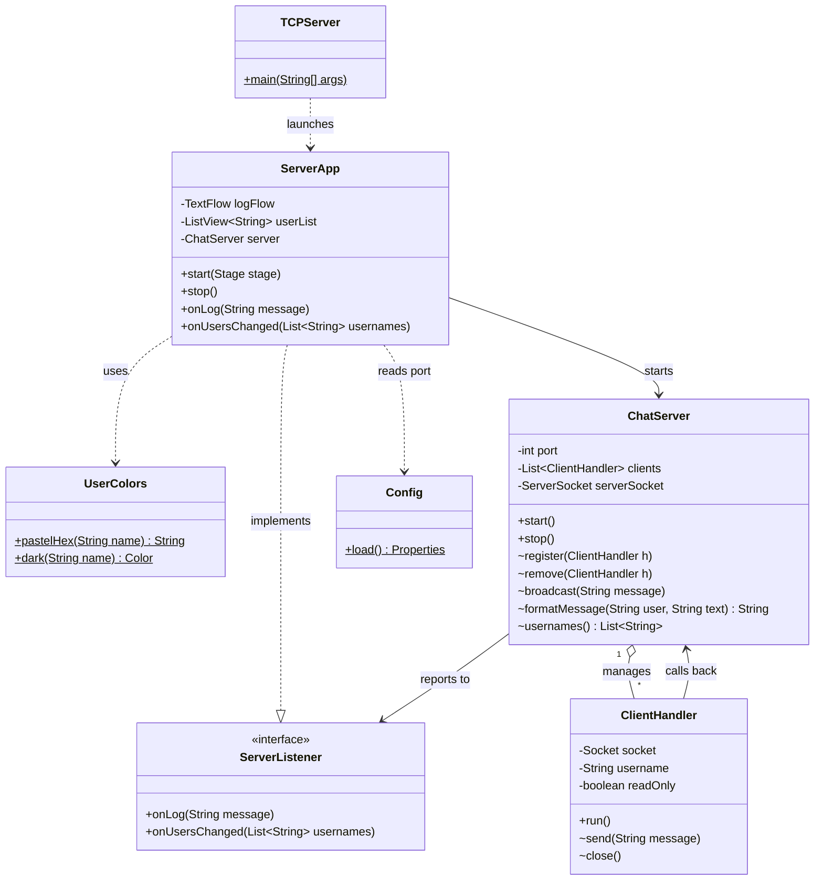
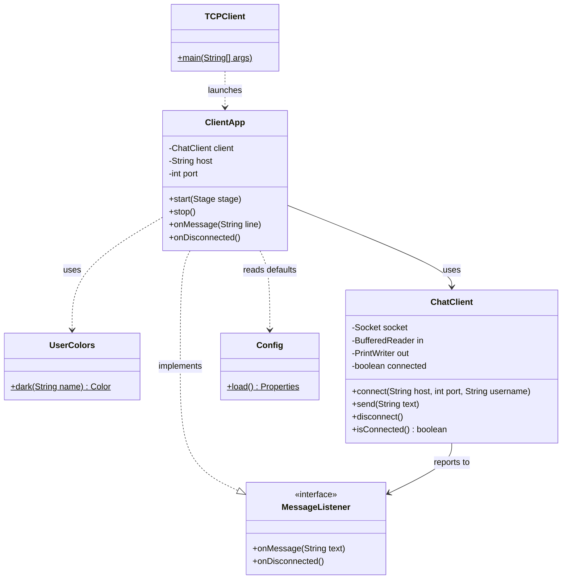
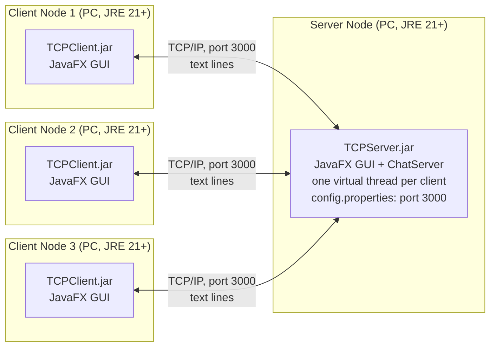

# UML Diagrams

## Class Diagram: Server

```mermaid
classDiagram
    class TCPServer {
        +main(String[] args)$
    }
    class ServerApp {
        -TextFlow logFlow
        -ListView~String~ userList
        -ChatServer server
        +start(Stage stage)
        +stop()
        +onLog(String message)
        +onUsersChanged(List~String~ usernames)
    }
    class UserColors {
        +pastelHex(String name)$ String
        +dark(String name)$ Color
    }
    class ServerListener {
        <<interface>>
        +onLog(String message)
        +onUsersChanged(List~String~ usernames)
    }
    class ChatServer {
        -int port
        -List~ClientHandler~ clients
        -ServerSocket serverSocket
        +start()
        +stop()
        ~register(ClientHandler h)
        ~remove(ClientHandler h)
        ~broadcast(String message)
        ~formatMessage(String user, String text) String
        ~usernames() List~String~
    }
    class ClientHandler {
        -Socket socket
        -String username
        -boolean readOnly
        +run()
        ~send(String message)
        ~close()
    }
    class Config {
        +load()$ Properties
    }

    TCPServer ..> ServerApp : launches
    ServerApp ..|> ServerListener : implements
    ServerApp --> ChatServer : starts
    ServerApp ..> UserColors : uses
    ChatServer --> ServerListener : reports to
    ChatServer "1" o-- "*" ClientHandler : manages
    ClientHandler --> ChatServer : calls back
    ServerApp ..> Config : reads port
```

## Class Diagram: Client

```mermaid
classDiagram
    class TCPClient {
        +main(String[] args)$
    }
    class ClientApp {
        -ChatClient client
        -String host
        -int port
        +start(Stage stage)
        +stop()
        +onMessage(String line)
        +onDisconnected()
    }
    class UserColors {
        +dark(String name)$ Color
    }
    class MessageListener {
        <<interface>>
        +onMessage(String text)
        +onDisconnected()
    }
    class ChatClient {
        -Socket socket
        -BufferedReader in
        -PrintWriter out
        -boolean connected
        +connect(String host, int port, String username)
        +send(String text)
        +disconnect()
        +isConnected() boolean
    }
    class Config {
        +load()$ Properties
    }

    TCPClient ..> ClientApp : launches
    ClientApp ..|> MessageListener : implements
    ClientApp --> ChatClient : uses
    ClientApp ..> UserColors : uses
    ClientApp ..> Config : reads defaults
    ChatClient --> MessageListener : reports to
```

## Deployment Diagram

```mermaid
flowchart LR
    subgraph PC1["Client Node 1 (PC, JRE 21+)"]
        C1["TCPClient.jar<br/>JavaFX GUI"]
    end
    subgraph PC2["Client Node 2 (PC, JRE 21+)"]
        C2["TCPClient.jar<br/>JavaFX GUI"]
    end
    subgraph PC3["Client Node 3 (PC, JRE 21+)"]
        C3["TCPClient.jar<br/>JavaFX GUI"]
    end
    subgraph SRV["Server Node (PC, JRE 21+)"]
        S["TCPServer.jar<br/>JavaFX GUI + ChatServer<br/>one virtual thread per client<br/>config.properties: port 3000"]
    end

    C1 <-->|"TCP/IP, port 3000<br/>text lines"| S
    C2 <-->|"TCP/IP, port 3000<br/>text lines"| S
    C3 <-->|"TCP/IP, port 3000<br/>text lines"| S
```
